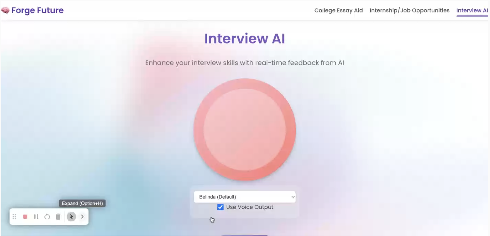

# FutureForge

> An AI-powered career preparation platform that helps students practice interviews, sharpen college essays, and discover internship or job opportunities.

FutureForge is a full-stack prototype focused on one question: what if students could rehearse high-stakes career moments with an AI coach that listens, responds, and gives feedback in real time?



## Why I Built This

Students often prepare for interviews and applications alone. They know they need practice, but they do not always have access to mentors, mock interviewers, or fast feedback.

FutureForge brings that coaching loop into a browser-based experience. The current build includes an Interview AI flow where a user speaks naturally, the backend sends their response to Gemini, and the app streams generated voice feedback back to the user.

## Features

- **Interview AI**: voice-first mock interview practice with AI-generated questions and feedback.
- **Real-time speech input**: browser speech recognition captures the user's spoken response.
- **AI interviewer backend**: Flask API uses Gemini to generate concise coaching responses.
- **Voice output**: generated feedback is converted into audio and streamed back to the frontend.
- **Career platform direction**: navigation and product structure for college essay aid, internship discovery, and interview prep.

## Demo Flow

1. The user opens the Interview AI page.
2. They start speaking through the browser.
3. The frontend sends the transcript to the Flask API.
4. Gemini generates the next interviewer response or feedback.
5. The backend converts that response to speech and streams audio back to the browser.

## Tech Stack

| Layer | Technology |
| --- | --- |
| Frontend | React, Web Speech API, Web Audio API |
| Backend | Python, Flask, Flask-CORS |
| AI | Google Gemini |
| Voice | Kokoro TTS pipeline, browser speech recognition |
| Audio | Streaming WAV chunks, SoundFile, NumPy |

## Project Structure

```text
FutureForge/
+-- backend/
|   `-- app.py              # Flask API for AI interview responses and voice streaming
+-- frontend/
|   `-- src/
|       `-- App.js          # React voice assistant UI
+-- assets/
|   `-- futureforge-interview-ai.png
+-- model.py                # Gemini model listing utility
+-- test.py                 # Local voice assistant experiment
+-- package.json
`-- README.md
```

## Getting Started

### Prerequisites

- Node.js
- Python 3.10+
- A Google Gemini API key
- A browser that supports speech recognition, such as Chrome

### Backend Setup

```bash
cd backend
python -m venv .venv
source .venv/bin/activate
pip install flask flask-cors google-generativeai SpeechRecognition kokoro soundfile numpy
export GEMINI_API_KEY="your-api-key"
python app.py
```

The API runs at:

```text
http://localhost:5000
```

### Frontend Setup

The current repository includes the React voice interface at `frontend/src/App.js`. To run it locally, use a standard React app shell and keep this file as the main app component:

```bash
npx create-react-app frontend
cd frontend
npm start
```

Then connect the app to the Flask backend at `http://localhost:5000`.

## API

### `POST /api/voice`

Accepts a JSON payload with transcribed user speech.

```json
{
  "text": "Tell me about yourself."
}
```

Returns streamed WAV audio containing the AI interviewer's response.

## What Makes It Interesting

FutureForge is not just a chatbot UI. The strongest part of the project is the real-time loop:

- capture voice in the browser
- reason over the user's answer with an LLM
- generate interview-style feedback
- stream voice output back to the user

That loop creates a more natural practice session than typing into a static chat window.

## Current Status

FutureForge is an early prototype. The Interview AI flow is the most developed part of the app, while the broader product direction includes college essay support and internship/job discovery.

Planned improvements:

- Move API keys and configuration fully into environment variables.
- Add a polished multi-page React UI for all three product areas.
- Add committed frontend app metadata and start scripts for one-command local setup.
- Add persistent interview sessions and progress history.
- Add structured feedback scores for clarity, confidence, relevance, and depth.
- Add deployment configuration for frontend and backend hosting.

## License

MIT
